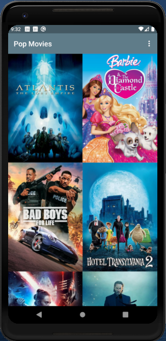
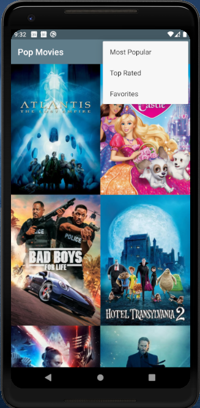

# PopularMovies

Popular Movies App with the Main Discovery Screen, a details view, and settings

### Project Set up

* Generate an API_KEY from [themoviedb.org](https://developers.themoviedb.org/)

* Add the API_Key to the `gradle.properties` file in this form;
  
  ```java
  org.gradle.jvmargs=-Xmx1536m
  android.useAndroidX=true
  android.enableJetifier=true

  POPULAR_MOVIES_API_KEY="xxxx_your_api_key_xxxx"
  ```

* Build the Project, and you're good to go :)


### Screenshots

 
 
